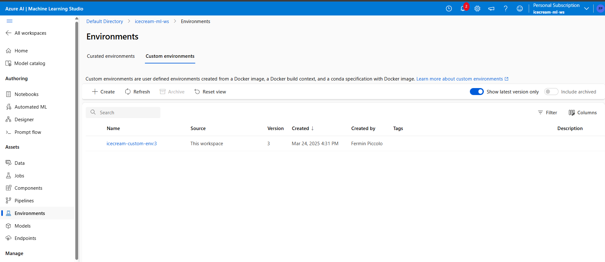
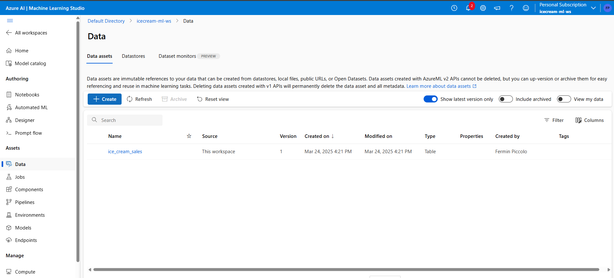
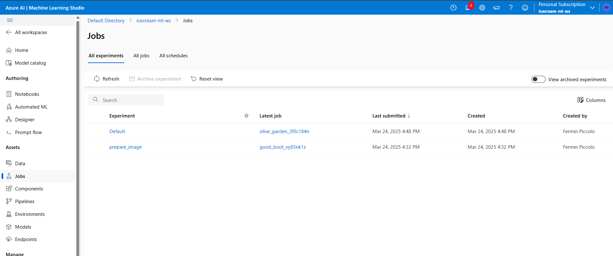
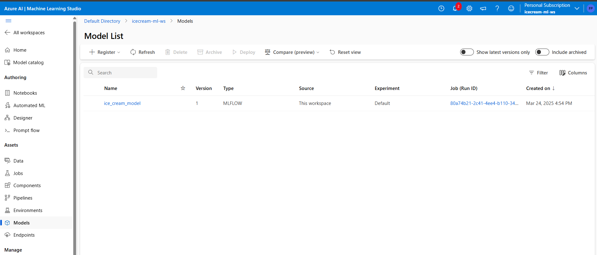
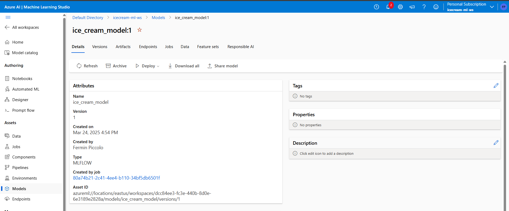
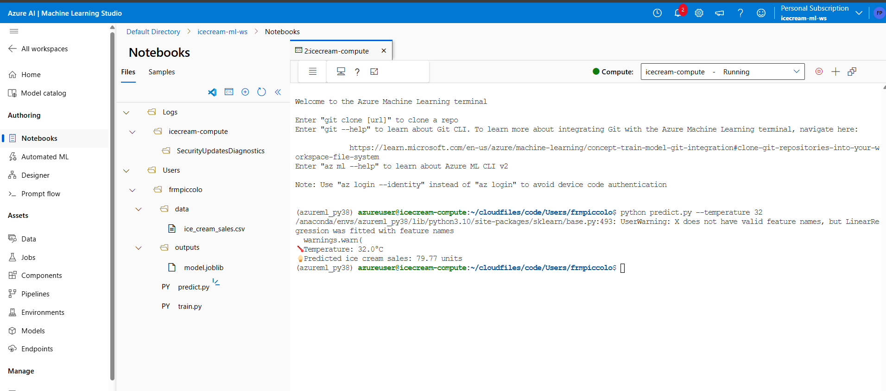

# Ice Cream Sales Forecasting with Azure ML and MLflow 🍦📊

Forecast daily ice cream sales based on temperature using a machine learning regression model. The project uses Azure Machine Learning and MLflow for experiment tracking and model deployment.

---

## 🔍 Project Overview

This project simulates a real-world scenario where an ice cream shop owner uses machine learning to optimize production based on temperature. By predicting daily sales, the owner can reduce waste and maximize profit.

---

## 🎯 Objectives

- ✅ Train a regression model using historical temperature and sales data
- ✅ Log the model using MLflow
- ✅ Deploy the model to Azure for real-time predictions
- ✅ Structure the project using best practices (pipelines, reproducibility)

---

## 🗂️ Project Structure

```
ice-cream-sales-prediction/
├── data/
│   └── ice_cream_sales.csv          # Example dataset
├── src/
│   ├── train.py                     # Script to train the model and log with MLflow
│   └── predict.py                   # Script to run predictions
├── inputs/
│   └── example_sentences.txt        # As per the project challenge
├── notebooks/
│   └── exploratory_analysis.ipynb   # Optional: EDA in notebook format
├── azure/
│   └── aml_config.json              # Azure ML workspace config
├── README.md                        # Complete documentation
└── requirements.txt                 # Python dependencies
```

---

## 🧪 Example Dataset

Located in `data/ice_cream_sales.csv`, this dataset contains historical temperature and corresponding daily sales.

---

## ⚙️ Setup Instructions

### 1. Prerequisites

- Python 3.8+
- An [Azure subscription](https://portal.azure.com/)
- VS Code with Azure ML and Python extensions
- Git

### 2. Clone the Repository

```bash
git clone https://github.com/YOUR_USERNAME/ice-cream-sales-prediction.git
cd ice-cream-sales-prediction
```

### 3. Install Dependencies

```bash
pip install -r requirements.txt
```

### 4. Set Up Azure ML Workspace

1. Create a new Azure ML Workspace in the Azure Portal
2. Download your `config.json` file and save it to `azure/aml_config.json`

### 5. Connect and Submit Experiments

Use `train.py` to train and log the model:

```bash
python src/train.py
```

This script:
- Trains a regression model
- Logs parameters, metrics, and model artifacts in MLflow
- Saves the model to the `outputs/` folder

### 6. Deploy the Model to Azure

(Optional) Register and deploy the model using Azure ML SDK or portal:
- Register the model
- Create an inference configuration
- Deploy to a container instance or AKS

### 7. Run Predictions

Use the `predict.py` script with a temperature value:

```bash
python src/predict.py --temperature 32
```

---

## 📝 Example Inputs

The `inputs/example_sentences.txt` file contains example use cases, questions, and insights gained during model exploration.

---

## 📊 Insights and Learnings

- There is a strong linear correlation between temperature and sales
- Simple regression models like `LinearRegression` can perform well in small datasets
- Azure ML and MLflow streamline training, logging, and deployment

---

## 📸 Screenshots

Here are some key screenshots that illustrate the project flow and outputs:

- 📂 Dataset registered in Azure ML Studio  
  

- ⚙️ Training script executed in Azure ML Notebook  
  

- ✅ Successful training and model output  
  

- 📈 MLflow experiment run with model artifacts  
  

- 🧠 Registered model in Azure ML Studio  
  

- 🔮 Prediction result using trained model  
  

---

## ⚙️ Step-by-Step Guide to Using Azure ML Studio

This section provides detailed steps to set up your Azure ML Workspace, upload data, train your model in the cloud, and optionally run the model locally with or without Azure.

---

### 🔵 Option A: Using Azure ML Studio (Cloud-Based)

> Ideal for running everything in the cloud, including data storage, training, logging, and deployment.

---

#### 1. Create Azure Resources

1. Log in to [Azure Portal](https://portal.azure.com/)
2. Create a new **Machine Learning workspace**
   - Subscription: Your Azure subscription
   - Resource group: Create new or use existing
   - Workspace name: `icecream-ml-ws`
   - Region: Choose closest to you (e.g., East US, Brazil South)
3. Wait for the workspace to be created

---

#### 2. Launch Azure ML Studio

1. Go to [ml.azure.com](https://ml.azure.com/)
2. Select your subscription and the workspace created above
3. You’ll be taken to Azure ML Studio

---

#### 3. Create Compute Resources

- **Compute Instance** (for notebooks and development):
  - Name: `icecream-compute`
  - VM Size: `Standard_DS11_v2` or smaller for testing
- **Compute Cluster** (optional for scaling training jobs):
  - Minimum nodes: 0
  - Maximum nodes: 2+

---

#### 4. Upload Your Dataset

1. Go to `Assets > Data`
2. Click `+ Create > From local files`
3. Name: `ice_cream_sales`
4. Type: Tabular
5. Upload `ice_cream_sales.csv` from the `data/` folder
6. Confirm and register the dataset

---

#### 5. Create a Custom Environment

1. Go to `Assets > Environments`
2. Create a new environment:
   - Name: `icecream-env`
   - Base: Python 3.8
   - Add required packages manually or upload `requirements.txt`
   - Enable MLflow support if available

---

#### 6. Create and Run Training Script

1. Upload `train.py` to `Notebooks` or use Git integration
2. Open a new notebook (or script job)
3. Submit a training job using the script:
   - Input: `ice_cream_sales` dataset
   - Environment: `icecream-env`
   - Compute: `icecream-compute` or cluster

---

#### 7. View Results and Registered Models

- Go to `Experiments` to see metrics and logs from MLflow
- Go to `Models` to view registered versions
- Optional: Deploy model as real-time endpoint (AKS/ACI)

---

### 🟢 Option B: Run Locally (With or Without Azure ML)

> You can test your model locally and optionally log to Azure ML using SDK. Or run completely disconnected from Azure.

---

#### 1. Setup Local Python Environment

```bash
python -m venv .venv
source .venv/bin/activate  # or .venv\Scripts\activate on Windows
pip install -r requirements.txt
```

#### 2. Run Training Locally

```bash
python src/train.py
```

This will:
- Load `data/ice_cream_sales.csv`
- Train the model locally
- Save it to `outputs/model.joblib`

If MLflow is configured locally, it will also log your run.

---

#### 3. Optional: Connect to Azure from Local Script

- Save `aml_config.json` in `azure/`
- Add the following to `train.py` before submitting:

```python
from azureml.core import Workspace
ws = Workspace.from_config(path="azure/aml_config.json")
```

You can now submit experiments or register models using `ws`.

---

#### 4. Run Predictions Locally

```bash
python src/predict.py --temperature 30
```

---

### ✅ Summary

| Feature             | Azure ML Studio | Local |
|---------------------|-----------------|-------|
| Training            | ✅              | ✅    |
| Logging w/ MLflow   | ✅              | ✅    |
| Data Registration   | ✅              | ❌    |
| Model Deployment    | ✅              | ❌    |
| Prediction          | ✅              | ✅    |

> **Tip**: Start locally, then migrate to the cloud for full MLOps workflows.

---

## 📬 Contact

Created by [Fermin Piccolo](https://www.linkedin.com/in/ferminpiccolo)

---

## ⚠️ Disclaimer on Azure Costs

> **Important**: This project uses Azure Machine Learning, which may incur costs depending on your resource usage. Always monitor your resource consumption in the Azure portal and stop compute instances when not in use.

Free-tier resources are available but limited. Use [Azure Pricing Calculator](https://azure.microsoft.com/en-us/pricing/calculator/) to estimate potential costs.

---
